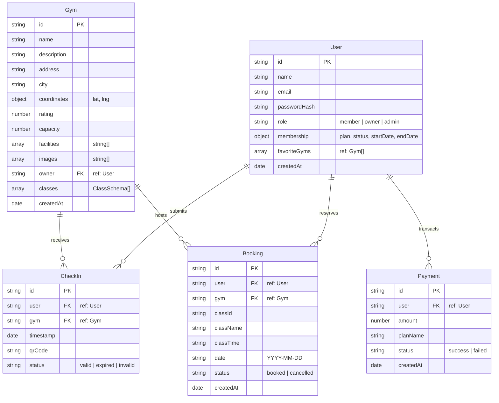

# Australian Fitness Aggregator Platform (MERN Stack)

A premium full-stack aggregator platform enabling members to access fitness clubs across Australia, book workouts, generate secure check-in QR passes (with 60-second rotation), and check metrics on custom dashboards.

---

## 🛠️ Technology Stack
- **Frontend:** React, TypeScript, Vite, Tailwind CSS (v4), Recharts (data visualizations), Lucide-React (icons).
- **Backend:** Node.js, Express.js, MongoDB (Mongoose Schemas), JWT (JSON Web Tokens) for authentication and dynamic QR codes.
- **Port Settings:** Backend runs on port `5050` (to avoid default macOS AirPlay port conflicts), and Frontend runs on `5173`.

---

## 🗄️ Database Design & Schema



### Schema Attributes & Mongoose Definitions
1. **User Schema**: Includes roles logic and embeds a `membership` sub-document indicating if a user's subscription is `active`, `cancelled`, or `inactive`.
2. **Gym Schema**: Contains geolocation coordinates (`lat`, `lng`), a facilities array, and embeds a `classes` schedule sub-document.
3. **CheckIn Schema**: Audits entries. Tracks the validity status of scanned tokens.
4. **Booking Schema**: Manages class attendance states (`booked` or `cancelled`).
5. **Payment Schema**: Records successful subscription checkout logs.

---

## 🌐 API Design & Endpoints List

All endpoints are prefixed with `/api`.

### 🔑 Authentication (`/api/auth`)
* `POST /auth/register` — Registers a new account.
  * *Payload*: `{ "name": "John Doe", "email": "john@fit.com", "password": "pass", "role": "member" }`
* `POST /auth/login` — Returns a valid JWT.
  * *Payload*: `{ "email": "john@fit.com", "password": "pass" }`
* `GET /auth/me` — Fetches current user profile and favorited gym bookmarks *(Requires Auth)*.
* `POST /auth/forgot-password` — Simulates resetting a password and returns a recovery token.
* `POST /auth/reset-password` — Updates password utilizing a recovery token.

### 🏋️ Gym Portfolios (`/api/gyms`)
* `GET /gyms` — Lists gyms with search queries (`search`), cities (`city`), and facilities (`facility`) filters.
* `GET /gyms/:id` — Fetches details, gallery, and schedule for a gym.
* `POST /gyms` — Registers a new location branch *(Requires Owner/Admin)*.
  * *Payload*: `{ "name": "...", "description": "...", "address": "...", "city": "...", "lat": -33.8, "lng": 151.2, "capacity": 100, "facilities": ["Sauna"], "images": ["..."] }`
* `PUT /gyms/:id` — Edits gym parameters *(Requires Gym Owner/Admin)*.
* `DELETE /gyms/:id` — Removes a gym location from the platform *(Requires Gym Owner/Admin)*.
* `POST /gyms/:id/favorite` — Toggles favoriting a gym bookmark *(Requires Member)*.
* `POST /gyms/:id/classes` — Schedules a fitness workout class *(Requires Owner/Admin)*.
  * *Payload*: `{ "name": "Yoga Flow", "instructor": "Sophia", "time": "08:00 AM - 09:00 AM", "capacity": 20 }`

### 🎟️ QR Passes & Check-In Validation (`/api/checkin`)
* `POST /checkin/generate-qr` — Generates a signed secure JWT entry pass valid for 60 seconds. *(Requires Active Membership)*.
  * *Payload*: `{ "gymId": "..." }`
* `POST /checkin/validate` — Entry scanner simulation. Decodes QR token, validates timestamp expiry, and enforces the **One Gym Per Day** check.
  * *Payload*: `{ "qrToken": "..." }`
* `GET /checkin/history` — Returns check-in logs history for the user.

### 📅 Workout Bookings (`/api/bookings`)
* `POST /bookings/book` — Reserves a slot. Enforces class capacity bounds to prevent overbooking.
  * *Payload*: `{ "gymId": "...", "classId": "...", "date": "YYYY-MM-DD" }`
* `POST /bookings/cancel/:id` — Cancels a booking and frees a slot.
* `GET /bookings/my` — Lists upcoming booked classes.

### 💳 Memberships Billing (`/api/memberships`)
* `POST /memberships/subscribe` — Activates membership plan (`basic`, `premium`, `vip`) and logs payment transaction.
* `POST /memberships/cancel` — Cancels subscription auto-renewals.
* `POST /memberships/upgrade` — Upgrades current plan and adjusts expiry.
* `GET /memberships/transactions` — Returns billing transaction logs.

### 📊 Dashboard Analytics (`/api/analytics`)
* `GET /analytics/owner` — Returns managed branch analytics (RSVPs, check-ins, revenues, utilization, charts) *(Requires Owner)*.
* `GET /analytics/admin` — Returns platform overview metrics (accounts, gyms, gross transaction revenue charts) *(Requires Admin)*.

---

## 🚀 Setting Up Locally

### Prerequisites
- Node.js installed.
- MongoDB service running locally on `mongodb://127.0.0.1:27017`.

### Setup Steps
1. **Clone and Navigate**:
   ```bash
   cd Australian-Fitness-Aggregator-Platform
   ```
2. **Setup Backend**:
   ```bash
   cd backend
   npm install
   # Create a .env file with the following variables:
   # PORT=5050
   # MONGODB_URI=mongodb://127.0.0.1:27017/fitness_aggregator_db
   # JWT_SECRET=super_secret_fitness_key_987654
   npm start
   ```
3. **Setup Frontend**:
   ```bash
   cd ../frontend
   npm install
   npm run dev
   ```
4. Open your web browser at `http://localhost:5173`.
